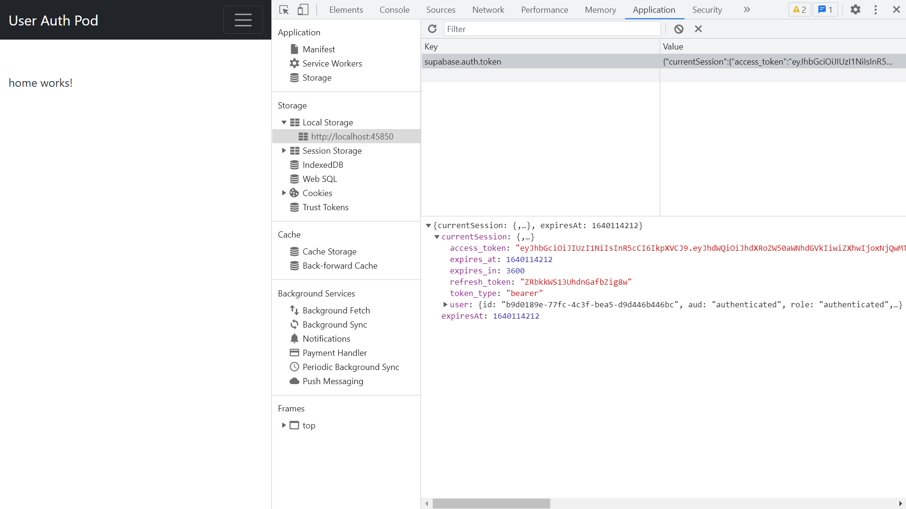

# Angular Supabase Access

* Angular frontend Authentication form with a Supabase PostgreSQL database backend
* Tutorial code from [Domini Code](https://www.youtube.com/channel/UC3QuZuJr2_EOUak8bWUd74A) - in Spanish
* **Note:** to open web links in a new window use: _ctrl+click on link_


## :page_facing_up: Table of contents

* [Angular Supabase Access](#angular-supabase-access)
  * [:page_facing_up: Table of contents](#page_facing_up-table-of-contents)
  * [:books: General info](#books-general-info)
  * [:camera: Screenshots](#camera-screenshots)
  * [:signal_strength: Technologies](#signal_strength-technologies)
  * [:floppy_disk: Setup](#floppy_disk-setup)
  * [:flashlight: Testing](#flashlight-testing)
  * [:computer: Code Examples](#computer-code-examples)
  * [:cool: Features](#cool-features)
  * [:clipboard: Status & To-Do List](#clipboard-status--to-do-list)
  * [:clap: Inspiration](#clap-inspiration)
  * [:file_folder: License](#file_folder-license)
  * [:envelope: Contact](#envelope-contact)

## :books: General info

* Supabase is an open-source alternative to Firebase, but uses PostgreSQL instead of document database. Database is realtime & can use SQL joins. Realtime notifications via Websockets. RESTful API requires no backend code.
* I had to have CORS Access Control Allow Origin enabled for this to work

## :camera: Screenshots



## :signal_strength: Technologies

* [Angular v14](https://angular.io/)
* [@angular/forms v14](https://angular.io/guide/reactive-forms) reactive form used for user input
* [Supabase public v1](https://supabase.io/)
* [npm @superbase/supabase-js v1](https://www.npmjs.com/package/@supabase/supabase-js) isomorphic (same in form) Javascript client for Supabase. Not updated to latest v2 due to breaking changes
* [rxjs v7](https://rxjs.dev/) Reactive Extensions Library for Javascript
* [Bootstrap v5](https://getbootstrap.com/) responsive styling, including ready-made [forms](https://getbootstrap.com/docs/5.0/forms/overview/), navbars etc.

## :floppy_disk: Setup

* `npm i` to install dependencies then...
* Create free account with Supabase and setup email auth
* add Supabase credentials to `environments/environment.ts`
* `ng serve` for a dev server. Navigate to `http://localhost:4200/` - app will automatically reload if you change any of the source files
* `npm run build` for a build folder with production configuration

## :flashlight: Testing

* `ng test` to execute the unit tests via [Karma](https://karma-runner.github.io).
* `ng e2e` to execute the end-to-end tests via [Protractor](http://www.protractortest.org/).

## :computer: Code Examples

* function to call signout function from auth service & catch errors (by Domini Code)

```typescript
  async onLogout(): Promise<void> {
    try {
      await this.authSvc.signOut();
    } catch (error) {
      console.log(error);
    }
  }
```

## :cool: Features

* Supabase user interface is cool to work with.
* User session stored in local storage, cleared upon user logout

## :clipboard: Status & To-Do List

* Status: Working
* To-Do: Nothing

## :clap: Inspiration

* [Login con Angular 13, Supabase & Bootstrap 5 - Login con Angular 13 - in Spanish](https://www.youtube.com/watch?v=qUhkSk52fV8&t=1754s)
* [Supabase Docs: Quickstart: Angular](https://supabase.com/docs/guides/with-angular)

## :file_folder: License

* N/A

## :envelope: Contact

* Repo created by [ABateman](https://github.com/AndrewJBateman), email: gomezbateman@yahoo.com
